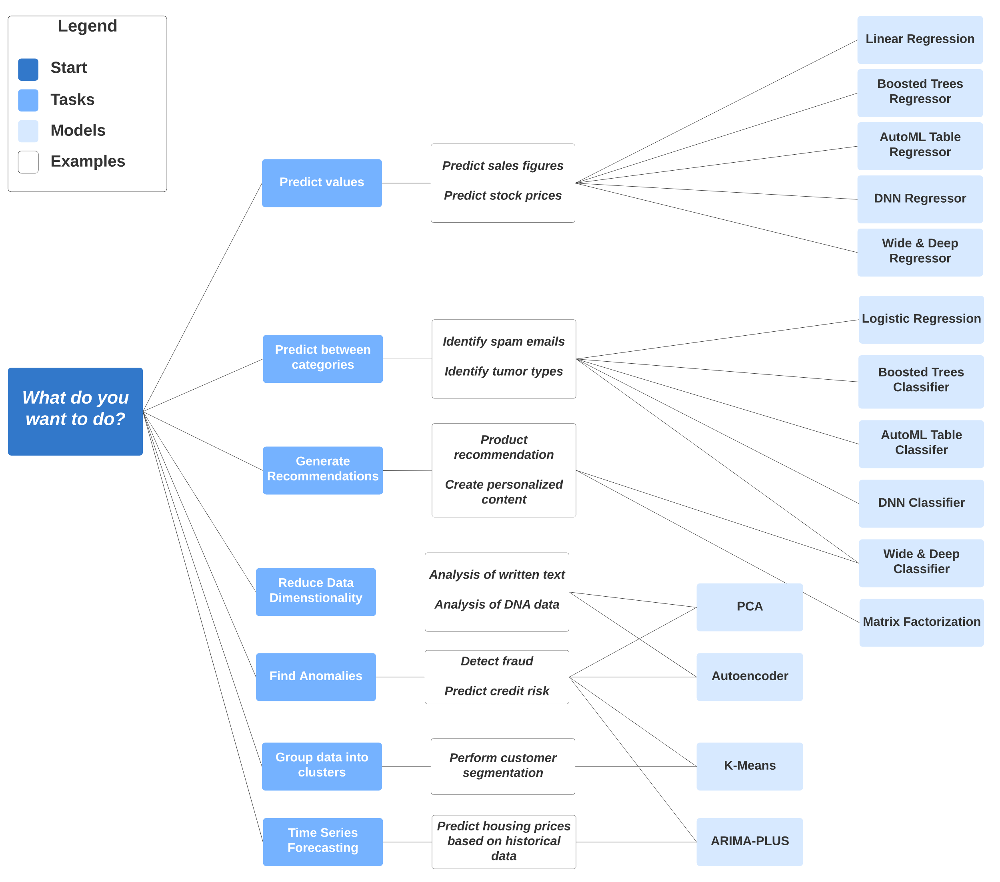

# Create ML Models with BigQuery ML

## Getting started with BigQuery ML

### BigQuery ML Introduction
BigQuery ML enables users to create and execute machine learning models in BigQuery using SQL queries. The goal is to democratise machine learning by enabling SQL practitioners to build models using their existing tools and to increase development speed by eliminating the need for data movement.

Usually, performing ML or AI on large datasets requires extensive programming and knowledge of ML frameworks. These requirements restrict solution development to a very small set of people within each company, and they exclude data analysts who understand the data but have limited ML knowledge and programming expertise. However, with BigQuery ML, SQL practitioners can use existing SQL tools and skills to build and evaluate models, and to generate results from LLMs and Cloud AI APIs.

You can work with BigQuery ML capabilities by using the following:

- The Google Cloud console
- The bq command-line tool
- The BigQuery REST API
- Integrated Colab Enterprise notebooks in BigQuery
- External tools such as a Jupyter notebook or business intelligence platform

Advantages of BigQuery ML:BigQuery ML offers several advantages over other approaches to using ML or AI with a cloud-based data warehouse:

- BigQuery ML democratizes the use of ML and AI by empowering data analysts, the primary data warehouse users, to build and run models using existing business intelligence tools and spreadsheets. Predictive analytics can guide business decision-making across the organization.
- You don't need to program an ML or AI solution using Python or Java. You train models and access AI resources by using SQL—a language that's familiar to data analysts.
- BigQuery ML increases the speed of model development and innovation by removing the need to move data from the data warehouse. Instead, BigQuery ML brings ML to the data, which offers the following advantages:
    - Reduced complexity because fewer tools are required.
    - Increased speed to production because moving and formatting large amounts of data for Python-based ML frameworks isn't required to train a model in BigQuery.

## Lab Notes
In this lab, you learn how to:

- Create BigQuery datasets
- Create, evaluate, and use machine learning models in BigQuery


#### List of queries used:
1. Query to create a BigQuery Model
```
#standardSQL
CREATE OR REPLACE MODEL `bqml_lab.sample_model`
OPTIONS(model_type='logistic_reg') AS
SELECT
  IF(totals.transactions IS NULL, 0, 1) AS label,
  IFNULL(device.operatingSystem, "") AS os,
  device.isMobile AS is_mobile,
  IFNULL(geoNetwork.country, "") AS country,
  IFNULL(totals.pageviews, 0) AS pageviews
FROM
  `bigquery-public-data.google_analytics_sample.ga_sessions_*`
WHERE
  _TABLE_SUFFIX BETWEEN '20160801' AND '20170631'
LIMIT 100000;
```

This SQL query creates or replaces a logistic regression model named `sample_model` in the `bqml_lab` dataset using BigQuery ML. Here's a breakdown of its components:

1. **Model Creation**:
   - The `CREATE OR REPLACE MODEL` statement defines a new model named `bqml_lab.sample_model`. If a model with this name already exists, it will be replaced.
   - The `OPTIONS(model_type='logistic_reg')` clause specifies that the model is a logistic regression model, suitable for binary classification tasks.

2. **Feature Selection and Labeling**:
   - The `SELECT` statement retrieves data to train the model.
   - **Label**:
     - `IF(totals.transactions IS NULL, 0, 1) AS label`: This creates a binary label indicating whether a transaction occurred. If `totals.transactions` is `NULL`, it assigns `0` (no transaction); otherwise, it assigns `1` (transaction occurred).
   - **Features**:
     - `IFNULL(device.operatingSystem, "") AS os`: Captures the operating system of the device, replacing any `NULL` values with an empty string.
     - `device.isMobile AS is_mobile`: Indicates whether the device is mobile (`TRUE` or `FALSE`).
     - `IFNULL(geoNetwork.country, "") AS country`: Records the country of the user, substituting `NULL` values with an empty string.
     - `IFNULL(totals.pageviews, 0) AS pageviews`: Counts the number of pageviews during the session, replacing `NULL` with `0`.

3. **Data Source and Filtering**:
   - The data is sourced from the Google Analytics sample dataset: `bigquery-public-data.google_analytics_sample.ga_sessions_*`.
   - **Date Range Filter**:
     - The `WHERE` clause filters the data to include only sessions between August 1, 2016 (`'20160801'`) and June 30, 2017 (`'20170630'`).
     - `_TABLE_SUFFIX BETWEEN '20160801' AND '20170630'`: This condition selects tables with suffixes corresponding to the specified date range.

4. **Data Limitation**:
   - `LIMIT 100000`: Restricts the training dataset to 100,000 records to manage computational resources and training time.

In summary, this query constructs a logistic regression model to predict the likelihood of a website session resulting in a transaction. It utilizes features such as the device's operating system, mobile status, user's country, and pageviews, based on data from the specified date range in the Google Analytics sample dataset.

2. Evaluate the model.
```
#standardSQL
SELECT
  *
FROM
  ml.EVALUATE(MODEL `bqml_lab.sample_model`, (
SELECT
  IF(totals.transactions IS NULL, 0, 1) AS label,
  IFNULL(device.operatingSystem, "") AS os,
  device.isMobile AS is_mobile,
  IFNULL(geoNetwork.country, "") AS country,
  IFNULL(totals.pageviews, 0) AS pageviews
FROM
  `bigquery-public-data.google_analytics_sample.ga_sessions_*`
WHERE
  _TABLE_SUFFIX BETWEEN '20170701' AND '20170801'));
```
This query evaluates the performance of a logistic regression model named `bqml_lab.sample_model` using a specified dataset. Here's a breakdown of its components:

1. **ML.EVALUATE Function**: This function computes evaluation metrics for a trained model, such as precision, recall, accuracy, F1 score, log loss, and ROC AUC for classification models. 

2. **Model Reference**: The model being evaluated is `bqml_lab.sample_model`.

3. **Evaluation Dataset**: The dataset is derived from the `bigquery-public-data.google_analytics_sample.ga_sessions_*` table, filtered to include data between July 1, 2017, and August 1, 2017.

4. **Feature Engineering**: The dataset includes the following features:
   - **label**: A binary indicator where sessions with transactions are labeled as 1, and those without as 0.
   - **os**: The operating system of the device, with null values replaced by an empty string.
   - **is_mobile**: A boolean indicating if the device is mobile.
   - **country**: The country of the user, with null values replaced by an empty string.
   - **pageviews**: The number of pageviews during the session, with null values replaced by 0.

5. **Wildcard Table Suffix**: The `_TABLE_SUFFIX` is used to filter the tables based on date partitions, selecting data from July 1, 2017, to August 1, 2017.

By executing this query, BigQuery ML will return evaluation metrics that assess how well the `sample_model` performs in predicting the likelihood of transactions based on the specified features in the evaluation dataset.

3. Use the Model

```
# Predict Purchases per Country
#standardSQL
SELECT
  country,
  SUM(predicted_label) as total_predicted_purchases
FROM
  ml.PREDICT(MODEL `bqml_lab.sample_model`, (
SELECT
  IFNULL(device.operatingSystem, "") AS os,
  device.isMobile AS is_mobile,
  IFNULL(totals.pageviews, 0) AS pageviews,
  IFNULL(geoNetwork.country, "") AS country
FROM
  `bigquery-public-data.google_analytics_sample.ga_sessions_*`
WHERE
  _TABLE_SUFFIX BETWEEN '20170701' AND '20170801'))
GROUP BY country
ORDER BY total_predicted_purchases DESC
LIMIT 10;

# Predict purchases per user
#standardSQL
SELECT
  fullVisitorId,
  SUM(predicted_label) as total_predicted_purchases
FROM
  ml.PREDICT(MODEL `bqml_lab.sample_model`, (
SELECT
  IFNULL(device.operatingSystem, "") AS os,
  device.isMobile AS is_mobile,
  IFNULL(totals.pageviews, 0) AS pageviews,
  IFNULL(geoNetwork.country, "") AS country,
  fullVisitorId
FROM
  `bigquery-public-data.google_analytics_sample.ga_sessions_*`
WHERE
  _TABLE_SUFFIX BETWEEN '20170701' AND '20170801'))
GROUP BY fullVisitorId
ORDER BY total_predicted_purchases DESC
LIMIT 10;
```
This query utilizes BigQuery ML to predict the likelihood of website visitors making purchases, aggregates these predictions by country, and identifies the top 10 countries with the highest predicted purchase counts. Here's a breakdown of the query:

1. **Prediction with `ML.PREDICT`**:
   - The `ML.PREDICT` function applies the previously trained logistic regression model `bqml_lab.sample_model` to new data, generating predictions.
   - The subquery within `ML.PREDICT` selects features from the Google Analytics sample dataset for the period between July 1, 2017, and August 1, 2017. The selected features are:
     - `os`: Operating system of the device (with null values replaced by an empty string).
     - `is_mobile`: Boolean indicating if the device is mobile.
     - `pageviews`: Number of pageviews during the session (with null values replaced by 0).
     - `country`: Country of the user (with null values replaced by an empty string).

2. **Aggregating Predictions**:
   - The outer query groups the prediction results by `country`.
   - It sums the `predicted_label` for each country to calculate `total_predicted_purchases`. In logistic regression models, `predicted_label` typically represents the predicted class label (e.g., 0 or 1). Summing these labels provides the total count of predicted purchases per country.

3. **Sorting and Limiting Results**:
   - The results are ordered in descending order of `total_predicted_purchases`, so countries with the highest predicted purchase counts appear first.
   - The `LIMIT 10` clause restricts the output to the top 10 countries.

In summary, this query applies a logistic regression model to predict purchase behavior for website visitors, aggregates these predictions by country, and lists the top 10 countries with the highest predicted purchase counts for the specified date range.


This SQL query utilizes BigQuery ML to predict the likelihood of website visitors making purchases, grouping the predictions by `fullVisitorId` to identify the top 10 visitors with the highest predicted purchase probabilities. Here's a breakdown of the query:

1. **Prediction with `ml.PREDICT`**:
   - The `ml.PREDICT` function applies the machine learning model `bqml_lab.sample_model` to a dataset, generating predictions.
   - The subquery selects features for prediction:
     - `os`: Operating system of the device, with `NULL` values replaced by an empty string.
     - `is_mobile`: Boolean indicating if the device is mobile.
     - `pageviews`: Number of page views during the session, with `NULL` values replaced by 0.
     - `country`: Visitor's country, with `NULL` values replaced by an empty string.
     - `fullVisitorId`: Unique identifier for the visitor.
   - The data is sourced from the Google Analytics sample dataset, specifically sessions between July 1, 2017, and August 1, 2017.

2. **Aggregation and Ranking**:
   - The outer query groups the prediction results by `fullVisitorId`.
   - It sums the `predicted_label` for each visitor, resulting in `total_predicted_purchases`, which estimates the number of purchases each visitor is predicted to make.
   - The results are ordered in descending order of `total_predicted_purchases`.
   - The `LIMIT 10` clause retrieves the top 10 visitors with the highest predicted purchase counts.

This query is useful for identifying individual visitors who are most likely to make purchases, enabling targeted marketing strategies or personalized user experiences.

## Model Selection Guide


## Predict Visitor Purchases with a Classification Model in BigQuery ML

BigQuery is Google's fully managed, NoOps, low cost analytics database. With BigQuery you can query terabytes and terabytes of data without having any infrastructure to manage or needing a database administrator. BigQuery uses SQL and can take advantage of the pay-as-you-go model. BigQuery allows you to focus on analyzing data to find meaningful insights.

BigQuery ML is a feature in BigQuery that data analysts can use to create, train, evaluate, and predict with machine learning models with minimal coding.

### Lab Notes
In this lab, you use a special ecommerce dataset that has millions of Google Analytics records for the Google Merchandise Store loaded into BigQuery. You use this data to create a classification (logistic regression) model in BigQuery ML that predicts customers' purchasing habits.

What you'll learn:

In this lab, you learn how to perform the following tasks:

- Use BigQuery to find public datasets
- Query and explore the ecommerce dataset
- Create a training and evaluation dataset to be used for batch prediction
- Create a classification (logistic regression) model in BigQuery ML
- Evaluate and improve the performance of your machine learning model
- Predict and rank the probability that a visitor will make a purchase

## Predict Taxi Fare with a BigQuery ML Forecasting Model

In this lab, you work with millions of New York City yellow taxi cab trips available in a BigQuery Public Dataset. You use this data to create a machine learning model inside of BigQuery to predict the fare of the cab ride given your model inputs and evaluate the performance of your model and make predictions with it.

### Lab Notes
In this lab, you learn to perform the following tasks:

- Use BigQuery to find public datasets
- Query and explore the public taxi cab dataset
- Create a training and evaluation dataset to be used for batch prediction
- Create a forecasting (linear regression) model in BigQuery ML
- Evaluate the performance of your machine learning model

## Bracketology with Google Machine Learning
### Lab Notes
In this lab, you will learn how to:

- Use BigQuery to access the public NCAA dataset
- Explore the NCAA dataset to gain familiarity with the schema and scope of the data available
- Prepare and transform the existing data into features and labels
- Split the dataset into training and evaluation subsets
- Use BigQuery ML to build a model based on the NCAA tournament dataset
- Use your newly created model to predict NCAA tournament winners for your bracket

#### View model training stats
Machine learning models "learn" the association between known features and unknown labels. As you might intuitively guess, some features like "ranking seed" or "school name" may help determine a win or loss more than other data columns (features) like the day of the week the game is played.

Machine learning models start the training process with no such intuition and will generally randomize the weighting of each feature.

During the training process, the model will optimize a path to it's best possible weighting of each feature. With each run it is trying to minimize Training Data Loss and Evaluation Data Loss.

Should you ever find that the final loss for evaluation is much higher than for training, your model is overfitting or memorizing your training data instead of learning generalizable relationships.

You can view how many training runs the model takes by clicking the TRAINING tab and selecting Table under View as option.

During our particular run, the model completed 3 training iterations in about 20 seconds. Yours will likely vary.


#### Note

For classification models, model accuracy isn't the only metric in the output you should care about.
Because you performed a logistic regression, you can evaluate your model performance against all of the following metrics (the closer to 1.0 the better):
- Precision: A metric for classification models. Precision identifies the frequency with which a model was correct when predicting the positive class.
- Recall: A metric for classification models that answers the following question: Out of all the possible positive labels, how many did the model correctly identify?
- Accuracy: Accuracy is the fraction of predictions that a classification model got right.
- f1_score: A measure of the accuracy of the model. The f1 score is the harmonic average of the precision and recall. An f1 score's best value is 1. The worst value is 0.
- log_loss: The loss function used in a logistic regression. This is the measure of how far the model's predictions are from the correct labels.
- roc_auc: The area under the ROC curve. This is the probability that a classifier is more confident that a randomly chosen positive example is actually positive than that a randomly chosen negative example is positive.

## Create ML Models with BigQuery ML: Challenge Lab

- Task1: Creating Dataset
- Task2: Create a forecasting BigQuery machine learning model
  - DATASET: Austin Bike Share
  - MODEL: Linear Regression
  - Features: starting station name, the hour the trip started, the weekday of the trip, and the address of the start station labelled as location. You must use 2019 Year data only to train this model.
- Task3: Evaluate the model performance
  - Task Details: Evaluate each of the precreated machine learning models in the dataset austin against 2019 data only using separate queries
- Task 4: Use the subscriber type machine learning model to predict average trip durations
  - Task Details: Use the subscriber type machine learning model to predict average trip length for trips from the busiest bike sharing station in 2019 where the subscriber type is Single Trip.

