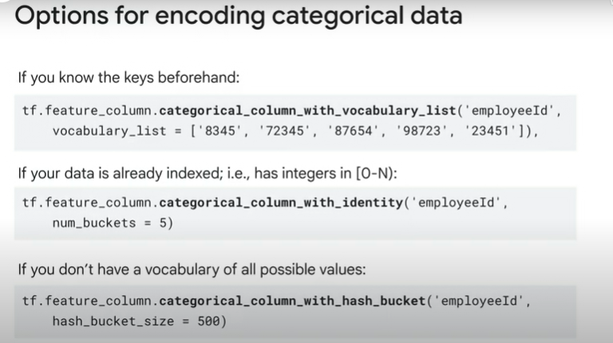
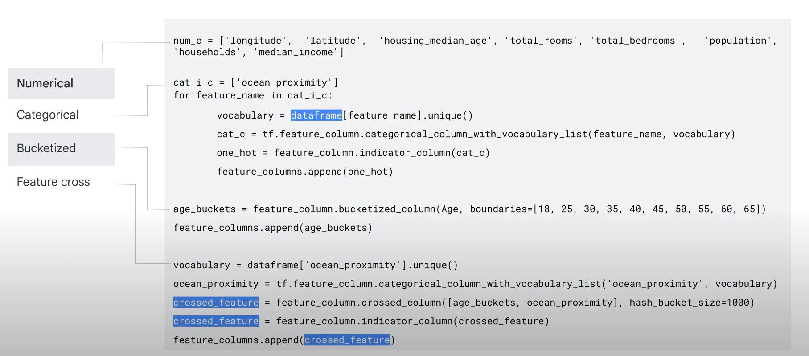
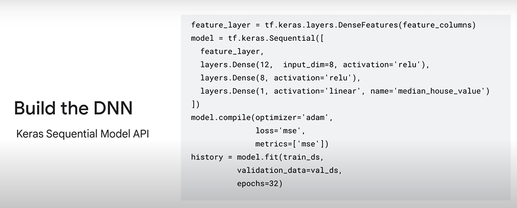
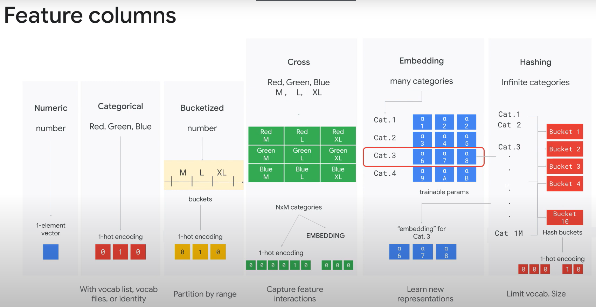

# Feature Engineering
## Introduction to Vertex AI Feature Store

### Introduction to Vertex AI Feature Store

Vertex AI Feature Store provides a centralized repository for organizing, storing and serving machine learning features. By using Feature Store
we can efficiently share, discover and reuse ML features at scale. It is a fully managed solution, It manages and scales the underlying infrastructure.

With Vertex AI Feature Store, we can store features with batch and stream import APIs and register the feature to its feature registry.This allows other team members such as data analysts, ML engineers, software developers and the data scientists to easily 
find the feature with Discovery API and retrieve the feature values for fast online serving with continuation feature monitoring.
They can also retrieve feature batches for training jobs and point-in-time lookup to prevent data leakage.

**Training Serving Skew**: which means the data you train with may be skewed or different from the data that is served in production.

**Challenges of working with ML Features**:
- Hard to share and reuse.
- Hard to reliably serve in production with low latency.
- Inadvertent skew in feature values between training and serving.

**Benefits of Feature Store**: 
- Share and reuse ML features across use cases: Centralized feature repository with easy APIs to search and discover features, fetch them for training and serving and manage permissions.
- Serve ML features at scale with low latency: Since the infrastructure is managed by GCP, developers can serve ML features at scale with low latency.
- Alleviate training-serving skew: Compute feature values once; and reuse them for both training and serving. We can also track and monitor for drift and other quality issues.
- Use batch streaming feature ingestion: allows for feature ingestion in large batches or in real time as data streams in.

### Feature Store terminology and concepts

- Feature Store: A top-level container for your features and their values.
    - When you set up a feature store, permitted users can add and share their features without additional engineering support.
    - Users can define features and then ingest or import feature values from various data sources.

- Entity Type: is a collection of semantically related features. 
    - You define your own entity types based on the concepts that are relevant to your use-case.
    - Each entity has a unique ID and is of type STRING.

- Entity View: When you retrieve values from a feature store, their service returns an entity view that contains the feature values that you requested.
    - You can think of an entity view as a projection of the features and values that feature store returns from an online or a batch serving request.

- For online serving requests, you can get all or a subset of features for a particular entity type.
- For batch serving requests, you can get all or a subset of features for one or more entity types.

- Feature:  is a value that is passed as an input to a model.
- In the feature store, the time stamps are an attribute of the feature values, not a separate resource type.
- There is a one-to-many relationship between an entity and a feature.
- Feature ingestion is the process of importing feature values computed by your feature engineering jobs into a feature store.
    - Before you can ingest data, the corresponding entity type and features must be defined in the feature store.
    - Feature store offers batch ingestion so that you can do a bulk ingestion of values into a feature store.
- Feature serving is the process of exporting stored future values for training or inference.
    - Feature store offers two methods for serving features:
        - Batch: Batch serving is for high-throughput and serving large volumes of data for offline processing.
        - Online: Online serving is for low-latency data retrieval of small batches of data for real-time processing, like for online predictions.

### Feature Store Data model

- The feature store data model includes an entity type, entities, features, and feature values.
- Feature Store uses a time series data model to store a series of values for features.
- This model enables Feature Store to maintain feature values as they change over time.
- The values in each column map to specific instances of an entity type or features, which are called entities and feature values.
- In the Feature Store, the timestamps are an attribute of the feature values, not a separate resource type.
- If all feature values were generated at the same time, you are not required to have a timestamp column.
- You can specify the timestamp as part of your ingestion request.

### Creating a Feature Store

- Reliably serving a feature in production with low latency is a challenge, and inadvertent skew in feature values between training and serving is common.
- Before creating a feature store, you'll need to preprocess your data.
    - no missing values, data types are consistent, etc.
- Requirements of the source data:
    - Vertex AI Feature Store can ingest data from tables in BigQuery or files in Cloud Storage
        - For files in cloud storage, the file type must be of CSV or Avro format.
        - You must have a column for entity IDs, and the values must be of type STRING.
        - Your source data values or your source data value types must match the value types of the destination feature in the feature store. For example, boolean values must be ingested into a feature that is of type bool or boolean.
        - All columns must have a header that is of type STRING.

        - For BigQuery tables, the column header is the column name. For Avro, the column header is defined by the Avro schema that is associated with the binary data. And for CSV files, the column header is the first row.
        - If you provide a column for feature generation timestamps, use right format for the file type:
            - Avro:  type long and logical time or logical type timestamp-micros.
            - CSV: timestamps must be in the RFC 3339 format.
            - BigQuery: timestamps must be in the TIMESTAMP column.

        - CSV files cannot include array data types. use Avro or BigQuery instead.
        - For array types, you cannot include a null value in the array although you can include an empty array.

- Creating the feature store:
    1. You can create a feature store in the Vertex AI console or the Vertex AI Workbench using the API.
        - After creating the feature store using the console, please note:
            - That you can not delete the feature store using the console. You must use the API instead.
            - Similarly, if you need to add another feature store, you must add it using the API.
    2. After creating the feature store, you need to create an entity type.
        - Entity types groups and contain-related features.
    3. After creating the Entity Type, you need to add feature to the entity type.
        - Feature is the measurable attribute of the entity type.
        - After you add features in your entity type, you can then associate your features with values stored in BigQuery or Cloud Storage.
        - The Feature requires 6 inputs from the user of which 3 are required:
            - Feature name (required)
            - Value type (required)
            - Description
            - Override monitoring values
            - Feature monitoring
            - Interval (required)

- Feature owners, such as data scientists, might monitor feature values to detect data drift over time.
- In feature store, you can monitor and set alerts on feature stores and features.
- Ingestion jobs import features data from BigQuery or Cloud Storage, so it can be used in a feature store.
    - Before you import data, you need to define the corresponding entity type and features.
- Feature store offers batch ingestion so that you can do a bulk ingestion of values into a feature store.
- Data for ingestion should have the following columns:
    - Entity_id: the ID of the ingested entity.
    - Timestamp:the timestamp at which the feature was generated or computed
    - Feature columns that match the destination feature name.

### Serving Features: Batch & Online

- Feature serving is the process of exporting stored feature values for training or inference.
- Feature Store offers two methods for serving features: 
    - Batch
    - Online.

- The key APIs are: 
    - Batch ingestion API: When a user ingests feature values via the batch ingestion API, the data is reliably written both to an offline store and to an online store.
        - The offline store will retain feature values for a long time so that they can later be retrieved for training.
        - The online store will contain the latest feature values for online predictions.
            - Online Serving API: used by client applications to fetch feature values to perform online predictions.
    - Batch serving API: fetch data from the offline store for training a model or for performing batch predictions.
        - To fetch the appropriate feature values for training, the batch serving API performs point in time lookups. With these lookups, you can mitigate data leakage by fetching only the feature values that were available before a prediction and not after.

    - Online serving is for low latency data retrieval of small batches of data for real-time processing, like for online predictions.
    - Batch serving is for high throughput and serving large volumes of data for offline processing, like for model training or for batch predictions.
    - Batch ingestion let's you ingest feature values in bulk from a valid data source. For each request, you can import values for up to 100 features for a single entity type. Note that you can run only one batch ingestion job per entity type to avoid any collisions.
    - batch serving jobs must be created in the Feature Store API.

## Raw Data to Features

### Introduction
- Turn raw data into features
- Compare good features versus bad features.
- Repreasent features.

### Overview of Feature Engineering

- Predictive models are constructed using supervised learning algorithms where classification or regression models are trained on historical data to predict future outcomes.
- Feature engineering is a crucial step in the process of predictive modeling.
- It involves the transformation of a given feature with the objective of reducing the modeling error for a given target.
- The underlying representation of the data is crucial for the learning algorithm to work effectively.
- The training data used in machine learning can often be enhanced by extraction of features from the raw data collected.
- In most cases, appropriate transformation of data is an essential prerequisite step before model construction.
- Feature engineering can be defined as a process that attempts to create additional relevant features from the existing raw features in the data and to increase the predictive power of the learning algorithm.
- It can also be defined as the process of combining domain knowledge, intuition and data science skill sets to create features that make the models train faster and provide more accurate predictions.
- Machine learning models such as neural networks accept a feature vector and provide a prediction.
    - These models learn in a supervised fashion where a set of feature vectors with expected output is provided.
- From a practical perspective, many machine learning models must represent the feature as real numbered vectors because the feature values must be multiplied by the model weights.
- In some cases, the data is raw and must be transformed into feature vectors.
- Features, the columns of your data frame, are key in assisting machine learning models to learn.
- Better features result in faster training and more accurate predictions.
- Engineering new features from a provided feature set is a common practice. Such engineered features will either augment or replace portions of the existing feature vector.
- These engineered features are essentially calculated fields based on the values of the other features.
- Feature vectors can be numerical, categorical, bucketized, crossed and hashed.
- Depending on your problem and your domain, you then need to leverage your domain-specific engineered features.
- Feature extraction is a process of dimensionality reduction by which an initial set of raw data is reduced to more manageable groups for processing.
- Principal component analysis, or PCA, is a way to reduce the number of variables or features in your data set. In technical terms, you want to reduce the dimension of your feature space.
    - By reducing the dimension of your feature space, you have fewer relationships between variables to consider, and you are less likely to overfit your model.
- Manual feature extraction: features are constructed manually, and in this lesson, we use manual feature extraction where we manually devise features using Python and TensorFlow code libraries.
- Automatic feature extraction: the idea is to automatically learn a set of features from potentially noisy raw data that can be useful in supervised learning tasks, such as in computer vision.
- You can also devise features using a combination of both automatic and manual methods.
- There's no well defined basis for performing effective feature engineering. It involves domain knowledge, intuition and most of all, a lengthy process of trial and error. The key learning is that different problems in the same domain may need different features.
- Feature engineering in reality is an iterative process.

### Raw Data to Features
- Analyze the problem, figure out the objective and the factors influencing the objective.
- Good feature engineering can take, on average, 50 to 75 percent of your time working with machine learning.

### Good features versus bad features
- Characteristics of a good feature in ML:
    - Must be related to the objective.
    - Be known at prediction time.
    - Be numeric with meaningful magnitude.
    - Have enough examples.
    - Good to have some human insights as well.
- Avoid data dredging. Data dredging refers to dredging the large dataset and finding spurious correlations. Larger the data set is, the more likely it is that there are lots of these spurious correlations.

### Availability of a feature at prediction time.
- Always ensure that the feature used to train the model would be available to be passed as input for predictions, when the model is deployed.
- You cannot train with current data and predict with stale data.

### Features should be numeric in nature
- Your features need to be numeric, and they need to have meaningful magnitudes. They need to be useful. You need to be able to do arithmetic on them, and you need to find vector representations in such a way that these kinds of qualities exist.
#### Word2Vec Process

Word2Vec is a popular technique used to convert words into numeric form, specifically vectors, which can be used as features in machine learning models. The process involves the following steps:

1. **Training a Neural Network**: Word2Vec uses a shallow, two-layer neural network to learn word associations from a large corpus of text.
2. **Context Window**: The model scans through the text using a context window, which is a fixed-size window that moves over the text to capture the context of each word.
3. **Skip-gram and CBOW Models**:
    - **Skip-gram**: This model predicts the context words given a target word. It works well with small amounts of data and represents rare words well.
    - **Continuous Bag of Words (CBOW)**: This model predicts the target word given the context words. It is faster and works well with larger datasets.
4. **Word Vectors**: The output of the neural network is a set of word vectors, where each word is represented by a vector of real numbers. These vectors capture semantic relationships between words.
5. **Cosine Similarity**: The similarity between words can be measured using cosine similarity, which calculates the cosine of the angle between two vectors. Words with similar contexts have vectors that are close together.

Word2Vec helps in capturing the meaning of words in a way that is useful for machine learning models, enabling them to understand and process text data more effectively.

### Features should have enough examples
- You need to have enough examples of feature value in the dataset, so it's the value of the feature.
- Avoid usage of peculiar data points in your dataset.Avoid outliers.
- Consider transforming scarce data into generalized data points by grouping similar data points together. For instance:
    - Dates can be grouped based on intervals such as monthly, quarterly and annually.
    - Numeric features can be made categorical by grouping them into intervals as well.

### Bring human insights to problem
- You need to have subject matter expertise and a curious mind to think of all of the ways a data field could be used as a feature.
- Remember that feature engineering is not done in a vacuum.
- After you train your first model, you can always come back and add or remove features for model two.

### Representing Features
- Converting data into a numeric form with magnitude that can be fed into the model is feature representation.
- Columns that can be fed directly to the model without any transformation is called as real-valued column. Example: Price, waitTime
- Categorical column with vocabulary list is a type of feature column.
- We cannot input strings directly to a model. Instead, we must first map strings to numeric or categorical values. Categorical vocabulary columns provide a good way to represent strings as a one-hot vector.
- Sparse column: A type of column in tensorflow that is one hot encoded and represents each key (list of possible values in that column),
    - Note, the keys provided has to be known beforehand.
- Handling columns whose keys maybe unknown beforehand.
    - The process behind transforming this column to a feature is as follows:
        - Step 1: You would preprocess this data to find out all the keys that occur in your training data set, and create a vocabulary of keys.
        - Step 2: Create dataset with the discovered keys in the training set. This is the vocabulary.
        - Step 3: The model uses the vocabulary during prediction to assign a value for input key.
            - Example: Emp ID 72365 --> [01000]
        - Model assigns a default vector for all unknown keys.
- Options in tensorflow for encoding categorical data

## Feature Engineering
### Introduction
- Topics covered:
    - Distinguish machine learning from statistics
    - Perform feature engineering using BigQuery ML
    - Perform feature engineering with Keras

### ML vs Stats

- Areas where ML and statistics diverge in terms opf concepts:
    - Handling Missing Values
        - Statistical Perspective: impute a value like the average for that column,
        - ML perspective: build a separate model for this situation where you have the data versus when you don't.
- In ML, we have enough data where we want to build something as fine-grained as we can.
- Statistics, on the other hand, is about keeping the data that you have and getting the best results out of the data that you have.
- Statistics is often used in a limited data regime where ML operates with lots of data, so having an extra column to flag with all of your missing data is what you would normally do in ML.
- Numerical features that have inverse normal or widely distributed data can not be used as a feature to predict a target as it is. They require transformation:
    - Fixed bin boundaries (Equal Width Binning): The process of converting the numerical features into categorical, where each bin belongs to a bin of fixed range.
    - Quantile boundaries (Equal-Frequency Binning): Equal-frequency binning divides a dataset into intervals (or bins) such that each bin contains approximately the same number of observations. Unlike equal-width binning, where bins are defined by specific ranges, equal-frequency binning ensures that each bin represents a quantile of the dataset. This method is particularly useful for datasets that have a skewed distribution, as it allows for a more balanced representation of data across different intervals.
        - Number of values in each bin is constant.
- Quite a few training cycles will be spent trying to get the unusual instances correct, so you're collapsing a long tail in ML versus removing them from those set in normal statistics.
-  modern architectures for ML end up taking variable magnitudes into account because of what's called as batch normalization.
#### Batch Normalization

Batch normalization is a technique used to improve the training of deep neural networks by normalizing the inputs of each layer. It helps in the following ways:

1. **Stabilizes Learning**: By normalizing the inputs, it reduces the internal covariate shift, which stabilizes the learning process and allows for higher learning rates.
2. **Reduces Overfitting**: It adds a slight regularization effect, which can help in reducing overfitting.
3. **Accelerates Training**: With normalized inputs, the network can converge faster, leading to quicker training times.
4. **Improves Gradient Flow**: It helps in maintaining the gradient flow through the network, which is crucial for training deep networks.

Batch normalization is applied during training and helps in achieving better performance and faster convergence of machine learning models.

### Basic Feature Engineering
- BigQuery preprocessing involves two aspects, representation transformation and feature construction.
    - Feature representation is 
        - Converting a numeric feature to a categorical feature through bucketization
        - Convert categorical features to a numeric representation (one-hot encoding, learning with counts, sparse feature embeddings, etc)
    - Feature Construction is
        - Creating new features by using techniques such as
            - Polynomial expansion by using univariate mathematical functions
            - Feature Crossing by capturing feature interactions
        - Features can also be constructed by using business logic from the domain of the ML use case.
- BigQuery ML supports two types of feature preprocessing, automatic and manual.
    - Automatic Preprocessing: Automatic preprocessing occurs during training.
    - Manual Preprocessing: BigQuery ML provides the transform clause for you to define custom preprocessing using the manual preprocessing functions.
        - You can also use these functions outside the transform clause.
        
### Performing Basic Feature Engineering using BQML

- In this lab, you utilize feature engineering to improve a model which predicts the fare amount for a taxi ride in New York City.
- In this lab, you:
    - Create a Workbench Instance Notebook.
    - Create SQL statements to evaluate the model.
    - Extract temporal features.
    - Perform a feature cross on temporal features.
    - Vertex AI offers two Notebook Solutions, Workbench and Colab Enterprise.

### Advanced Feature Engineering: Feature crosses
- Advanced Feature Engineering Pre-processing functions in BigQueryML
    - ML Feature Cross: Does a feature cross of all the combinations.
        - Feature cross is a technique used in machine learning to create new features from existing ones. By combining two or more features, you can capture interactions between them that a model might not detect otherwise.
    - TRANSFORM: allows you to specify all preprocessing during model creation. The preprocessing is automatically applied during the prediction and evaluation phases of machine learning.
    - ML BUCKETIZE: lets you split a numerical expression into buckets. The function signature looks something like this.
        - ML.BUCKETIZE(numerical_expression, array_split_points [, exclude_boundaries] [, output_format])

    - Feature Cross:
        - It's about memorization.
            - memorization means a model's inability to generalize to unseen data.
            - Memorization works when you have so much data that for any single grid cell within your input space the distribution of data is statistically significant.
        - Feature crosses are a powerful feature preprocessing technique on large data sets.
        - When you do a feature cross, the input is very very sparse:
            - The resulting feature would require a combination of m * n dimensions. Where 'm' and 'n' are the unique values in the respective features being crossed.
            - Sparse models contain fewer features and therefore are easier to train on limited data.
            - Fewer features also means less chance of overfitting.
            - Fewer features also mean it is easier to explain to users because only the most meaningful features remain.

- Spatial Function: refers to a function that operates on data with spatial coordinates, allowing analysis and manipulation of data based on its geographic location, like calculating distances between points, finding areas of polygons, or identifying spatial relationships between different data points, essentially incorporating geographical information into the machine learning model.
    - Note that the geography or spatial functions operate or generate BigQuery geography values.
    - The signature of any geography function starts with ST_.
    - ST_Geogpoint:
    - ST_Distance:

- Temporal Function: refers to a function that incorporates the concept of time, meaning it analyzes data points based on their temporal order or sequence, taking into account the relationships between observations at different time points; essentially, it's a function that models how data changes over time. 
    - 

- BigQuery ML, by default, assumes that numbers are numeric features and strings are categorical features.
- We need to convert both the day of week and hour of day features to strings because the model neural network will automatically treat any integer as a numerical value rather than a categorical value.
- Casting day of week and hour of day as strings ensures that each element will be treated like a label and will have its own associated coefficient.

### Bucketize and Transform Function
- Bucketize: is a preprocessing function that creates buckets or bins. Converts continuous numerical feature into a string feature with bucket names as the value.
- Bucket name is in the format of bin.
- BigQuery ML now supports defining data transformations during model creation. Which will be automatically applied during prediction and evaluation.
- The advantage of encapsulating features in the TRANSFORM clause is that the client code doing the predict doesn't change.
- These transformed columns are post-process, with standardization for numerics and one-hot encoding for categorical variables by default.
- TRANSFORM clause must be placed after the CREATE statement.
- Some Features, will need statistics over a limited period of time window, like he number of products sold over the past hour. For these types of time-windowed features, you will use Beam, batch and streaming data pipelines.

### Apache Beam

Apache Beam is an open-source, unified model for defining both batch and streaming data-parallel processing pipelines. It provides a high-level API for building complex data processing workflows that can run on multiple execution engines, such as Apache Flink, Apache Spark, and Google Cloud Dataflow. Apache Beam allows you to:

- Write your pipeline once and run it on multiple execution environments.
- Handle both batch and streaming data in a single pipeline.
- Use a rich set of built-in transformations and I/O connectors.
- Scale your data processing workflows efficiently.

Apache Beam is particularly useful for creating time-windowed features, such as calculating the number of products sold over the past hour, by leveraging its powerful windowing and triggering capabilities.

### Google Cloud Dataflow

Google Cloud Dataflow is a fully managed service for stream and batch data processing. It allows you to develop and execute a wide range of data processing patterns, including ETL, batch computation, and continuous computation. Dataflow is based on the Apache Beam model, providing a unified programming model that simplifies the development of both batch and streaming pipelines. Key features include:

- **Scalability**: Automatically scales your data processing jobs to handle large volumes of data.
- **Flexibility**: Supports both stream and batch processing within the same pipeline.
- **Integration**: Seamlessly integrates with other Google Cloud services such as BigQuery, Cloud Storage, and Pub/Sub.
- **Efficiency**: Optimizes resource usage and performance with dynamic work rebalancing and autoscaling.
- **Ease of Use**: Provides a rich set of APIs and a user-friendly interface for building and managing data pipelines.

Dataflow is ideal for building complex data processing workflows that require real-time analytics, data transformation, and machine learning preprocessing.

### House Price Prediction Notes

- tf.data: The tf.data API enables you to build complex input pipelines from simple, reusable pieces.
    - The tf.data API makes it possible to handle large amounts of data, read from different data formats, and perform complex transformations.
- Most machine learning performance is heavily dependent on the representation of the feature vector.
- As a result, much of the actual effort in deploying machine learning algorithms goes into the design of preprocessing pipelines and data transformations.
- Often you don't want to feed a number directly into the model, but instead split its value into different categories based on numerical ranges.
- Combining features into a single feature, better known as feature crosses, enables a model to learn separate weights for each combination of features.

- FEATURE ENGINEERED INPUT PIPELINE CODE SNIPPET

- Keras Sequential Model API: Used to build a neural network. 
    - The Keras Sequential Model API is a high-level interface for building neural networks in a sequential manner. It allows you to stack layers one by one to create a model, making it easy to design and experiment with different architectures. This API is particularly useful for beginners and for quickly prototyping models.
    - The sequential model API is a way of creating deep learning models where an instance of the sequential class is created and model layers are created and added to it.
    - Some common and useful layer types you can choose from are dense, fully connected layer, and the most common type of layer used on multilayer perceptron models, dropout.
- Dropout: 
    - **Dropout**: Dropout is a regularization technique used in deep learning to prevent overfitting. During training, dropout randomly sets a fraction of the input units to zero at each update, which helps to break up situations where network units co-adapt too much. This forces the network to learn more robust features that are useful in conjunction with many different random subsets of the other neurons. Dropout is typically applied to the fully connected layers of the neural network.
    - Apply dropout to the model, setting a fraction of inputs to 0 in an effort to reduce overfitting, and merge.

- Deep learning Model Architecture:
    - Usually a stack of linear dense layers.
    - The first layer in your model must specify the shape of the input. This is the number of input attributes and is defined by the input_dim argument. This argument expects an integer.
    - The last layer is the output layer and we use linear as the activation function.

- Activation Functions:
    **Activation Functions**: Activation functions are mathematical functions used in neural networks to introduce non-linearity into the model. They help the network learn complex patterns in the data. Common activation functions include:

    - **ReLU (Rectified Linear Unit)**: Outputs the input directly if it is positive; otherwise, it outputs zero. It is widely used due to its simplicity and effectiveness.
    - **Sigmoid**: Maps the input to a value between 0 and 1, often used in binary classification problems.
    - **Tanh (Hyperbolic Tangent)**: Maps the input to a value between -1 and 1, often used in hidden layers of neural networks.
    - **Softmax**: Converts a vector of values into a probability distribution, often used in the output layer of classification models.

    - Choosing the right activation function is crucial for the performance of the neural network.

    - Keras also supports a range of standard neuron activation functions such as ReLU, softmax, rectifier, 10-H, and sigmoid.

    - You can typically specify the type of activation function used by layer in the activation argument, which takes a string value.

- After you define your model, it needs to be compiled.
- Model Compilation: you compile the model using a compile function and it accepts three important attributes, model optimizer, loss function, and metrics.
    - Optimizer is a search technique used to update weights in your model.
    -   Adaptive moment estimation or adam is a popular gradient descent optimizer that uses adaptive learning rates.
        **Adam Optimizer**: The Adam optimizer is an adaptive learning rate optimization algorithm designed for training deep learning models. It combines the advantages of two other popular optimizers: AdaGrad and RMSProp. Adam computes adaptive learning rates for each parameter by maintaining two moving averages: the mean (first moment) and the uncentered variance (second moment) of the gradients. This allows Adam to adjust the learning rate dynamically based on the historical gradient information, leading to faster convergence and improved performance. The key parameters of Adam include the learning rate, beta1 (exponential decay rate for the first moment), beta2 (exponential decay rate for the second moment), and epsilon (a small constant to prevent division by zero). Adam is widely used due to its efficiency and effectiveness in handling sparse gradients and noisy data.
- Metrics are evaluated by the model during training.

- Batch size: is the number of training instances shown to the model before a weight update is performed.

- Code Snippet: Building the model.

- Lambda Layers: Lambda layers in Keras are anonymous custom layers. Lambda layers in Keras help you to implement layers or functionality that are not pre-built, and which do not require trainable weights.

- Here are the different feature engineering types that can be applied to feature columns.

### Lab: Performing Basic Feature Engineering in Keras
- Learning objectives
    - Create an input pipeline using tf.data.
    - Engineer features to create categorical, crossed, and numerical feature columns.

- https://www.tensorflow.org/guide/data

### Lab: Performing Advanced Feature Engineering in Keras
- Learning objectives
    - Process temporal feature columns in Keras.
    - Use Lambda layers to perform feature engineering on geolocation features.
    - Create bucketized and crossed feature columns.

## Pre-Processing and Feature Creation

### Introduction: Preprocessing and Feature Creation: Apache Beam and Dataflow module.

- In this module, you will learn more about Dataflow, which is a complementary technology to Apache Beam, and both of them can help you build and run preprocessing and feature engineering.
- In this module, you learn to explain Apache Beam and describe Dataflow.

### Apache Beam and Dataflow
- Cloud Dataflow
    Google Cloud Dataflow is a fully managed service for stream and batch data processing. It allows you to develop and execute a wide range of data processing patterns, including ETL, batch computation, and continuous computation. Dataflow is based on the Apache Beam model, providing a unified programming model that simplifies the development of both batch and streaming pipelines. Key features include:

    - **Scalability**: Automatically scales your data processing jobs to handle large volumes of data.
    - **Flexibility**: Supports both stream and batch processing within the same pipeline.
    - **Integration**: Seamlessly integrates with other Google Cloud services such as BigQuery, Cloud Storage, and Pub/Sub.
    - **Efficiency**: Optimizes resource usage and performance with dynamic work rebalancing and autoscaling.
    - **Ease of Use**: Provides a rich set of APIs and a user-friendly interface for building and managing data pipelines.

    Dataflow is ideal for building complex data processing workflows that require real-time analytics, data transformation, and machine learning preprocessing.
- Pipeline: a sequence of steps that change data from one format into another.

- Cloud Dataflow is a platform that allows you to run data processing pipelines.
- Dataflow can run pipelines written in Python and Java programming languages.
- Dataflow sets itself apart as a platform for data transformations because it is a serverless, fully managed offering from Google that allows you to execute data processing pipelines at scale.
- As a developer, you don't have to worry about managing the size of the cluster that runs your pipeline.
- Dataflow can change the amount of computer resources, the number of servers that will run your pipeline and do that elastically depending on the amount of data that your pipeline needs to process.
- The way that you write code for Dataflow is by using an open-source library called Apache Beam.
- To implement a data processing pipeline, you write your code using the Apache Beam APIs and then deploy the code to Cloud Dataflow.
- One of the coolest things about Apache Beam is that it supports both batch and streaming data processing using the same pipeline code.
- Regardless of whether your data is coming from a batch data source, like Google Cloud Storage, or even from a streaming data source, like PubSub, you can reuse the same pipeline logic. You can also output data to both batch and streaming data destinations.
- You can also easily change these data sources in the pipeline without having to change the logic of your pipeline implementation.
- since Apache Beam is an open-source project, companies can implement their own connectors.

### Dataflow terms and concepts
- The pipeline must have a source, which is where the pipeline gets the input data.
- The pipeline has a series of steps.
- Each of the steps in Beam is called a transform.
- Every transform gets a PCollection as input and outputs the result to another PCollection.
    - PCollection: 
        - PCollection does not store all of its data memory.
        - PCollection is like a data structure with pointers to where the dataflow cluster stores your data.

- Sink: The output of the pipeline
- Runner: platform-specific, it is the machine that takes your pipeline and executes the code.
    - You can even implement your own custom runner for your own distributed computing platform.
- beam.Pipeline() --> creates a pipeline instance.
    - every transform is implemented as an argument to the apply method of the pipeline.
- In the Python version of the Apache Beam library, the pipe operator is overloaded to call the apply method.
- Apache Beam SDK comes with a variety of connectors that enable dataflow to read from many data sources, including text files in Google Cloud Storage or file systems.
- BigQuery Data Warehouse on GCP.
- When using the BigQuery connector, you need to specify the SQL statement that BigQuery will evaluate to return back at table with rows of results.
- In order to avoid contention issues where multiple servers are trying to get a file locked to the same file concurrently, by default the TextIO connector will shard the output, writing the results across multiple files on the file system.
- To submit the pipeline as a job, to execute in dataflow on GCP, you need to provide some additional information.You need to include arguments with the name of the GCP project, location in Google Cloud Storage Bucket, where dataflow will keep some staging and temporary data, and you also need to specify the name of the runner, which in this case is that dataflow runner.