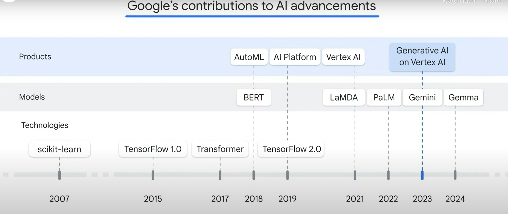
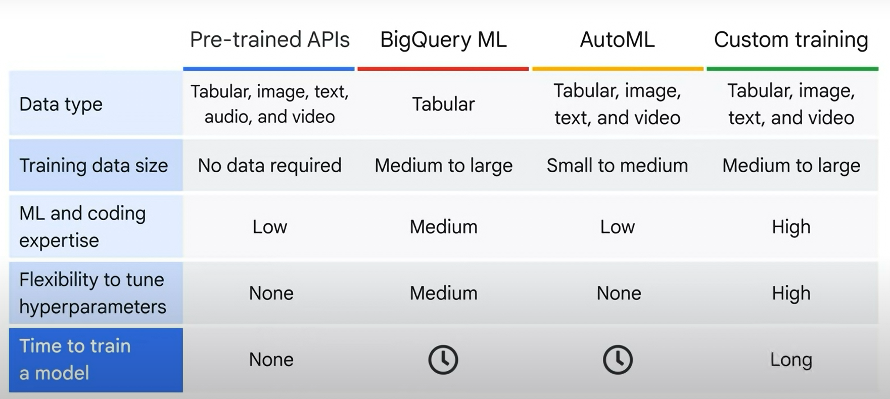
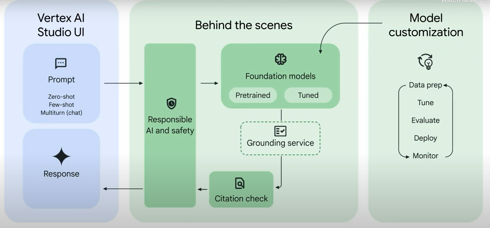

# 02 Introduction to AI and Machine Learning on Google Cloud
## Introduction
* Layers of AI and ML solutions organization on GC:
    1. AI foundation layer: where you learn about cloud essentials like compute, storage, and network, and data tools such as data pipelines and data analytics.
    2.  AI development layer: where you explore different options to build an ML project, including out-of-the-box solutions, low-code or no-code, and DIY (do-it-yourself).
    3. Generative AI: and you learn how generative AI empowers the AI development and AI solutions layers.

## AI Foundations

* Google's AI offering milestones :

* Why google leads in the field of AI & ML innovations?
    1. State of the art AI models: Build on excellence.
    2. End to end development and MLOps: More efficient.
    3. Unified Data to AI platform: Develop with ease.
    4. Efficient & Scalable: get more for less.

* Responsible AI refers to the development and use of artificial intelligence systems in a way that prioritizes ethical considerations, fairness, accountability, safety, and transparency.

* 7 principles of responsible AI:
    * AI should be socially beneficial.
    * AI should avoid creating or reinforcing unfair bias.
    * AI should be built and tested for safety.
    * AI should be accountable to people.
    * AI should incorporate privacy design principles.
    * AI should uphold high standards of scientific excellence.
    * AI should be made available for uses that accord with these principles

* Course toolbox for AIML on GC:
    1. AI foundation layer: where you learn about cloud essentials like compute, storage, and network, and data tools such as data pipelines and data analytics.
        * Cloud essentials like compute and storage.
    2.  AI development layer: where you explore different options to build an ML project, including out-of-the-box solutions, low-code or no-code, and DIY (do-it-yourself).
        * Options to develop an ML model from beginning to end on Google Cloud.
            * Pre-trained APIs
            * BigQuery ML
            * AutoML
            * Custom Training
    3. Generative AI: and you learn how generative AI empowers the AI development and AI solutions layers.
        * Vertex AI
        * Vertex AI pipelines SDK

## Google Cloud Infrastructure:

* You can think of the Google Cloud infrastructure in terms of three layers.
    1. Networking & Security Layer
    2. Compute & Storage
    3. Data and AI Products

* Compute Solutions on GC
    * Google compute engine (GCE)
    * Google Kuberneteres Engine (GKE)
    * App Engine
    * Cloud Functions
    * Cloud Run:  a fully managed compute platform that enables you to run requests or event-driven stateless workloads without having to worry about servers.

* TPUs are Google’s custom-developed application-specific integrated circuits (ASICs) used to accelerate machine learning workloads.

* Google Cloud provides managed storage and database services that are scalable, reliable, and easy to operate. These are:
* Worldwide object storage:
    1. Cloud Storage
* Relational Database Services 
    1. Cloud SQL
    2. Cloud Spanner
    3. Big Query
* Non-Relational Database Services
    1. Firestore
    2. Cloud bigtable

* Google cloud Data and AI products
    * Ingestion and Process data: 
        * Pub/Sub
        * DataFlow
        * Cloud data fusion
        * Dataproc
    * Storage:
        * Cloud storage.
        * Cloud SQL
        * Cloud Spanner
        * Big Query
        * Firestore
        * Cloud Bigtable
    * Analytics
        * BigQuery
        * Looker (BI tool)
    * AI and ML
        * AI solutions
            * Documents AI
            * Contact center AI
            * Vertex AI Search for retail
            * Healthcare Data Engine
        * AI development
            * Vertex AI
                * AutoML
                * Workbench
                * Colab Enterprise
                * Vertex AI studio
                * Model Garden
        * These products are either integrated with generative AI or embedded with generative AI capabilities.

## ML model categories

* Artificial intelligence, or AI, is an umbrella term that includes anything related to computers mimicking human intelligence.

* Machine learning is a subset of artificial intelligence (AI) that allows computers to learn without being explicitly programmed.
    * Supervised Learning: deals with labeled data, is task-driven and identifies a goal.
        * Classification: Which identifies if a data point belongs to a certain category.
        * Regression: Which predicts the target variable which is a numerical data type.
    * Unsupervised learning: deals with unlabeled data, is data driven and identifies a pattern.
        * Clustering: Grouping like data points together.
        * Association: Identifying underlying relationships between variables.
        * Dimensionality Reduction: Reduces the number of dimensions.

* Deep Learning: subset of machine learning that adds layers in between input data and output results to make a machine learn at much depth.

* Big Query ML:
    * Fully managed storage facility
    * SQL based analytics engine

## AI Development Options

* Google's AI development options:
    * out-of-the-box
    * low-code and no-code
    * do-it-yourself.
* Google Cloud offers four options for building machine learning models:
    * Pre-Trained APIs: lets you use pre-trained machine learning models, so you don’t need to build your own if you don’t have training data or machine learning expertise in-house.
    * BigQueryML: uses SQL queries to create and execute machine learning models in BigQuery.
    * AutoML: a no-code solution that helps you build your own machine learning models on Vertex AI through a point-and-click interface.
    * Custom Training: through which you can code your very own machine learning environment, training, and deployment.
* BigQuery ML only supports tabular data, whereas the other three support tabular, image, text, and video.

## Google Pre-Trained APIs
* API stands for application programming interface, and they define how software components communicate with each other.
* Pre-Trained APIs: Are offered as services and can be plugged into the applications as a ready made AIML solution. 
* Natural Language API derives insights from text using pre-trained large language models.
    * Detects entities, sentiments, syntax & categories from text.

## Vertex AI

* Vertex AI: is the unified platform that supports various technologies and tools on Google Cloud to help you build an ML project from end to end.
* Google’s solution to many of the production and ease-of-use challenges is Vertex AI, a unified platform that brings all the components of the machine learning ecosystem and workflow together.
* Vertex AI verticals:
    * Vertex AI provides an end-to-end ML pipeline to prepare data, and create, deploy, and manage models over time, and at scale.
    * Vertex AI is a unified platform that encompasses both predictive AI and generative AI.

* Vertex AI allows users to build ML models with either AutoML, a no-code solution, or custom training, a code-based solution.
* Benefits of Vertex AI:
    1. Seamless: Vertex AI provides a smooth user experience from uploading and preparing data all the way to model training and production.
    2. Scalable: The machine learning operations (MLOps) provided by Vertex AI help to monitor and manage the ML production and therefore scale the storage and computing power automatically.
    3. Sustainable: All of the artifacts and features created using Vertex AI can be reused and shared.
    4. Speedy: Vertex AI produces models that have 80% fewer lines of code than competitors.
* In addition to AutoML and custom training, Vertex AI also provides tools for generative AI.

## AutoML
* AutoML, which stands for automated machine learning, aims to automate the process to develop and deploy an ML model.
* Four phases of AutoML:
    1. Data processing: 
        * After you upload a dataset, AutoML provides functions to automate part of the data preparation process.
    2. Searching the best model and fine-tuning parameters (AutoSearch): 
        * Two critical processes supports AutoSearch which are:
            * Neural architect Search:  helps search the best models and tune the parameters automatically.
                * The goal of neural architecture search is to find optimal models among many options. Tries different architectures and models, and compares against the performance between models to find the best ones.
            * Transfer Learning:  helps speed the searching by using the pre-trained models.
                * Transfer learning is a powerful technique that lets people with smaller datasets or less computational power achieve great results by using pre-trained models trained on similar, larger datasets.
    3. Packaging best model and preparing data for predictions
    4. Prediction

* By applying these advanced ML technologies, AutoML automates the pipeline from feature engineering, to architecture search, to hyperparameter tuning, and to model ensemble.

## Custom Training
* Custom Training: Allows you to create your own machine learning environment to experiment with and build your own ML pipelines.
* There are two options:
    1. Pre-built container:
    2. Custom container:
* Tools to code your ML model
    1. Vertex AI workbench:  a Jupyter notebook deployed in a single development environment that supports the entire data science workflow, from exploring to training and then deploying a machine learning model.
        * You can also use Colab Enterprise, which was integrated into Vertex AI Platform in 2023 so data scientists can code in a familiar environment.

*  TensorFlow: an end-to-end open platform for machine learning supported by Google. Tensorflow contains multiple abstraction layers. The TensorFlow APIs are arranged hierarchically, with the high-level APIs built on the low-level APIs.
    * The lowest layer is hardware: TensorFlow can run on different hardware platforms including CPU, GPU, and TPU.
    * The next layer is the low-level TensorFlow APIs, where you can write your own operations in C++ and call the core, basic, and numeric processing functions written in Python.
    * The third layer is the TensorFlow model libraries, which provide the building blocks such as neural network layers and evaluation metrics to create a custom ML model.
    * The high-level TensorFlow APIs like Keras sit on top of this hierarchy.

* Process behind building models with tensorflow (tf.keras)
    1. Create the model: where you piece together the layers of a neural network and configure the layers.
    2. Compile the model: specify hyperparameters such as performance evaluation and model optimization.
    3. Train the model: 

* Note that Vertex AI fully hosts TensorFlow from low-level to high-level APIs

* JAX: high-performance numerical computation library that is highly flexible and easy to use.

## AI Development Workflow

## ML Workflow
* Stages of ML workflow:
    1. Data preparation
        * Upload data
            * Data can be batch or streaming.
            * Can be structured or unstructured.
        * Feature Engineering
    2. Model development
        * Train model.
        * Evaluate the model.
    3. Model serving
        * Deploy the model.
        * Monitor the model.

* ML development is not linear, it is iterative.

* Two options to set up the workflow with Vertex AI are:
    1. AutoML
        * no-code solution that lets you build an ML model through UI. Useer friendly.
    2. Vertex AI workbench or colab
        * Code-based approach
        * Using SDKs
        * Experienced users
        * Vertex AI Pipelines is essentially a tool kit that includes pre-built SDKs and software development kits, which are the building blocks of a pipeline.

## Stage 1 of ML workflow : Data preparation

* The data can come from Cloud Storage, BigQuery, or even your local machine.
* AutoML supports four types of data: image, tabular, text, and video.
* For each data type, AutoML solves different types of problems, called objectives.
* ML applications For Image data:
    * Image classification (single or multi label)
    * Image object detection. ( A form of classification)
    * Image segmentation
* ML applications for Tabular data:
    * Regression/classification.
    * Forecasting
* ML applications for Text data:
    * Text classification (single or multi label)
    * Text entity extraction
    * Text sentiment analysis
* ML applications for video data:
    * Video action recognition
    * Video classification
    * Video object tracking
* Although the tasks can be similar, pre-trained APIs rely on Google’s pre-trained ML models with no customer data, whereas AutoML trains a custom model using your own data.
* Complex use cases might require a combination of multiple data types and different objectives to solve a business problem.

* A feature refers to a factor that contributes to the prediction. 
    * Vertex AI feature store: centralized repository to manage, serve and share features.
        * It aggregates the features from different sources in BigQuery and makes them available for both real-time (often called online) and batch (often called offline) serving.
        * Vertex AI automates the feature aggregation to scale the process with low latency.
        * Vertex AI Feature Store is ready for the challenge of generative AI. It can manage and serve embeddings, which is the crucial data type in gen AI.
        * It also supports retrieving similar items in real time, ensuring low latency.
        * The workflow to set up and start real time (online) serving using Vertex AI Feature Store can be summarized as follows:
            1. Prepare the data source in BigQuery.
                * Optional: Register the data sources by creating feature groups and features.
            2. Configure the connection to the data source.
            3. Serve the latest features.
        * Benefits of Vertex AI Feature Store:
            * Features are shareable for training and serving.
                * They are managed and served from a central repository, maintaining consistency across your organization.
            * Features are reusable.
            * Features are scalable.
            * Easy to use.
## Stage 2 of ML workflow : Model Development
* Stage where we train the model and evaluate the result.
* This stage involves two steps: 
    1. model training
    2. model evaluation
* To setup an ML model we need to specify a few things:
    1. Training method: 
        * Specify the dataset.
        * Training objective: Goal of the model being trained. (Task you want to solve).
        * Model training method:
            * AutoML
            * Custom training (Advanced.)
    2. Model details : 
        * training the model to solve a supervised learning problem such as regression and classification, you must choose the target column from your dataset.
    3. Training options:
        * can choose certain features to participate in the training and transform the data type if needed.
    4. Compute and pricing: 
        * specify the budget and pricing, and then click Start training.

* AutoML will train the model for you and choose the best performed models among thousands of others.
* The powerful technologies that power AutoML
    * Neural architecture.
    * Transfer learning.
* Vertex AI provides extensive evaluation metrics to help determine a model’s performance.
    * Confusion Matrix: is a specific performance measurement for machine learning classification problems. It’s a table with combinations of predicted and actual values.
        * True Positive (TP): When prediction and actual is positive.
        * True Negative (TN): When prediction and actual is negative.
        * False Positive (FP): Model predicted positive and it's false.
        * False Negative (FN): Model predicted negative and it's false.

        * Recall: 
            * Refers to all the positive cases, and looks at how many were predicted correctly.
            * Recall = TP/TP+FN
        * Precision:
            * Refers to all the cases predicted as positive, and how many are actually positive.
            * Precision = TP/TP+FP

 * Precision and recall are often a trade-off. Depending on your use case, you might need to optimize for one or the other.

 * Consider the following example to understand the trade-off between recall and precision:
    * Consider a spam classification model (spam/notspam):
        * If the goal is to catch as many potential spam emails as possible, model might want to prioritize recall.
        * if the goal is to only catch the messages that are definitely spam without blocking other emails, model might want to prioritize precision.

* Precison - Recall curve

* Feature Importance: 
    * In Vertex AI, feature importance is displayed through a bar chart to illustrate how each feature contributes to a prediction.

* Feature importance is just one example of Vertex AI’s comprehensive machine learning functionality called Explainable AI.
* Explainable AI is a set of tools and frameworks to help understand and interpret predictions made by machine learning models.

## Stage 3 of ML workflow : Model Serving
* Model serving consists of two steps: 
    * Model deployment
    * Model Monitoring

* model deployment: which is the exciting time when the model is implemented and ready to serve.
* Model deployment can be implemented in two ways:
    * Endpoint:
        * Makes real-time predictions.
        * Uses an endpoint.
        * used when immediate results with low-latency are required.
    * Batch prediction:
        * Makes predictions in batches. ( multiple inputs)
        * No endpoint or API
        * Used when immediate response is not required.

* Model can be deployed to off-cloud environments as well. This approach is generally adopted when the model needs to be deployed in a specific environment to mitigate latency, ensure privacy, or enable offline functionality.

* Once the model is deployed and begins making predictions or generating contents, it is important to monitor its performance.

* The backbone of automating ML workflow on Vertex AI is a tool kit called Vertex AI Pipelines. It automates, monitors, and governs machine learning systems by orchestrating the workflow in a serverless manner.

## MLops and workflow automation
* You have two approaches to build an end-to-end ML workflow:
    1. Codeless: Google Cloud console, like AutoML on Vertex AI.
    2. Code a pipeline that automates the ML workflow.

* MLOps combines machine learning development with operations and applies similar principles from DevOps (or development operations) to machine learning models.

* MLOps aims to solve production challenges related to machine learning. In this case, this refers to building an integrated machine learning system and operating it in production.

* These are considered to be some of the biggest pain points by the ML practitioners’ community, because both data and code are constantly evolving in machine learning.

* The backbone of MLOps on Vertex AI is a tool kit called Vertex AI Pipelines, which supports both Kubeflow Pipelines, or KFP, and TensorFlow Extended, or TFX.

* An ML pipeline contains a series of processes and runs in two different environments.
    1. Experimentation, development, and test environment, And second is the staging, pre-production, and production environment.
    2. Staging, pre-production, and production environment.

* In the development environment, you start from data preparation which includes data extraction, analysis, and preparation, to model development like training, evaluation, and validation.
    * The result is a trained model that can be entered in model registry.
* Once the model is trained, the pipeline moves to the staging and production environment, where you serve the model, which includes prediction and monitoring.
* Each of these processes can be a pipeline component, which is a self-contained set of code that performs one task of a workflow. You can think of a component as a function, which is a building block of a pipeline. Two types of components:
    1. Pre-built provided by Google.
    2. Custom: to create components that perform tasks specific to your use case.

* Organizations often implement ML automation in three phases.
    * Phase 0: No automation
    * Phase 1: Automate parts of the workflow such as training.
    * Phase 2: Integrate components to have a complete automated workflow.

* Stages to building a pipeline:
     1.  Plan it as a series of components.
        * To promote reusability, each component should have a single responsibility.
    2. Create the required components.
    3. Assemble pipeline by organizing components sequentially.

* Stages of running a pipeline:
    1. Compile the pipeline
    2. Run it.

* Google Cloud also visualizes the pipeline based on the coding, with which you can easily check the components and the corresponding artifacts.

## How a machine learns

* Types of AI networks:
    1. Artificial Neural network
    2. Deep neural network
    3. Convolutional neural network
    4. Recurrent neural network
    5. Large Language Models

* Artificial NNs are also referred to as neural networks or shallow neural networks.
* An ANN has three layers: an input layer, a hidden layer, and an output layer. 
* And each layer consists of nodes(x).
    * Each node represents a neuron.
* The nodes are interconnected (edges) and mimic the synopses similar to the case of neurons.
* Each edges have weights(w). Think of it as a variable that changes with respect to neurons.
    * The weights retain information that a neural network learned through the training process and are the mysteries that a neural network aims to discover.

* The math behind the learning process:
    * Step 1 :Calculate the weighted sum: Multiply each input value by its corresponding weight, and then sum the products.
        * Normally includes a bias component. (constant)
    * Step 2 :Apply activation function to weighted sum
        * Activation functions: activation function is used to prevent linearity or add non-linearity.
            * The weighted sum of the input and weights or in other words the result (y) will always be a linear function to the input x.
            * Without activation functions the output function that resolves to give (y) will always be linear to the inputs (x).
            * If y can be estimated by x as a cause of their linearity, we do not need the hidden layers. And the problem reduces to a linear function. Which defeats the purpose of ANNs.
            * <b> Activation functions convert a linear network to a non-linear one.</b>
    * Step 3 : weighted sum is calculated for the output layer, assuming multiple neurons in the hidden layers.
    * Step 4 : apply an activation function to the weighted sum.
    * Step 5: Obtain the result (y). y hat is the representation of the actual result and y is the actual result and calculate the cost function.
    * Step 6 Backpropagation : Rejig the weights.
        * Take cost functions and turn them into a search strategy.
        * Gradient Descent: process of walking down the surface formed by the cost function and finding the bottom.
            * Direction: Derivative of the cost function
                * If derivative is negative: You are at the left side of the curve.
                * If derivative is positive: You are at the right side of the curve.
            * Step-size: 
                * The step size depends on the learning rate, which determines the learning speed of how fast you bounce around to reach the bottom.
                * If the step size is too small, your training might take too long.
                * If the step size is too large, you might bounce from wall to wall or even bounce out of the curve entirely, without converging.
    * Step 7: Iteration.
        * One complete pass of the training process from step 1 to step 6 is called an epoch.
* Weights or parameters are adjusted until the cost function reaches its optimum.
* Some of the widely used activation functions:
    1. Rectified linear unit (ReLU):
    // To be filled.

* Loss Function: It is the assesment to determine how close the predicted (y) is to the actual value.
    * Also known as cost function.
    * Loss function is used to calculate errors for a single training instance, whereas cost function is used to calculate errors from the entire training set.

* If the difference is significant, the neural network knows that it did a bad job in predicting and must go back to learn more and adjust parameters.

* In a neural network, weights and biases are parameters learned by the machine during training. You have no control of the parameters except to set the initial values.

* The number of layers and neurons, activation functions, learning rate, and epochs are hyperparameters, which are decided by a human before training.

*  learning rate decides how fast a machine learns and the number of epochs defines how many times the learning iterates.
* tool like AutoML, it automatically selects the hyperparameters for you and saves you plenty of experiment time.

*  cost or loss functions, which are used to measure the difference between the predicted and actual value. used to minimize error and improve performance.
* backpropagation to modify the weights and bias if the difference/cost is significant, and gradient descent to decide how to tune the weights and bias and when to stop.

## Generative AI
* Artificial intelligence that generates content for you. The generated content can be multi-modal, including text, code, images, speech, video, and even 3D. It learns from a massive amount of existing content such as text, image, and video.
* The process of learning from existing content is called training, which results in the creation of a “foundation model.”
* A foundation model is usually a large model in the sense of a significant number of parameters, massive size of training data, and high requirements of computational power.
* Transformers: 
* Current GCP GenAI Offerings:
    * Gemini: Multimodal processing
    * Gemma: Language generation
    * Codey: Code Generation
    * Imagen: Image processing
* Gemini has the potential to replace some of these models, as it can process data across multiple modalities.
* Gen AI fields of application:
    1. Solve general problems: A foundation model can then be used directly to generate content and solve general problems, such as content extraction and document summarization.
    2. Solve specific problem: It can also be trained further with new datasets in your field to solve specific problems, such as financial model generation and healthcare consulting.

* Pre-trained vs Fine-tuned : pre-train a foundation model for a general purpose with a large dataset and then fine-tune it for specific aims with a much smaller dataset.
* large language model, which is a typical type of generative AI foundation model, is trained for general purposes to solve common language problems such as text classification, question answering, document summarization, and text generation across industries.
* The models can then be tailored to solve specific problems in different fields, such as: retail, finance, and entertainment, by using relatively small datasets from these fields.

* Powered by the foundation models like Large Language Models, or LLMs, generative AI is driving new opportunities to enhance productivity, save operational costs, and create new values.

* Vertex AI offers a range of tools for tuning your gen AI models and developing gen AI projects, like Vertex AI Studio and Model Garden.

* GenAI workflow on GCP:

* General process:
    1. Input Prompt: Via the Vertex AI Studio UI, input a prompt—a natural language request to gen AI models.
        * Zero shot
        * Few shot
        * Multiturn (chat)
    2. Responsible AI and safety measures: The prompt undergoes responsible AI and safety checks, configurable through the UI or code.
    3. Foundation models: The screened prompt proceeds to foundation models like Gemini multimodal or other gen AI models like Imagen and Codey based on your choices.
    4. Model customization: Optionally, customize gen AI models to fit your data and use cases by further tuning them.
    5. Results grounding: Gen AI models return results that undergo grounding (optional) and citation checks to prevent hallucinations.
    6. Final response: The final response appears on the Vertex AI Studio UI after a final check through responsible AI and safety measures.

* Vertex AI Studio provides an intuitive interface between developers and the foundational models. It enables you to build gen AI applications in a low-code or even no-code environment, where you can: 
    * Rapidly test and prototype models.
    * Tune and customize models using your own data.
    * Augment them with real-world, up-to-date information.
    * Deploy models efficiently in production environments with auto-generated code.

* Multimodal Model: a large foundation model that is capable of processing information from multiple modalities, including text, image, and video.
* Gemini is such a multimodal model trained by Google.
* Gemini excels at a diverse range of multimodal use cases.
    1. Description and captioning: Gemini can identify objects in images and videos, providing detailed or concise descriptions as needed.
    2. Information extraction: it can read text from images and videos, extracting important information for further processing.
    3. Information analysis: it can analyze the information it extracts from images and videos based on specific prompts.
    4. Information seeking: Gemini can answer questions or generate Q&A based on the information it extracts from text, images and videos.
    5. Content creation: it can create stories or advertisements using images and videos as inspiration.
    6. Data conversion: it can convert text responses to various formats, such as HTML and JSON.

* How can developers engage with Gemini and create applications that leverage multimodal capabilities?
    1. Using a user interface (UI) with the Google Cloud console: This no-code solution is ideal for exploring and testing prompts.
    2. Using predefined SDKs in different languages like Python and Java with notebooks like Colab and Workbench, which are seamlessly integrated within the Vertex AI platform.
    3. Utilizing Gemini APIs in conjunction with command-line tools like Curl.

* Prompt: prompt is a natural language request submitted to a model in order to receive a response.
* Anatomy of a prompt:
    1. Input (required): represents your request for a response from the model. Can take various forms:
        * Question input: A question that the model can answer, which is a question input.
        * Task input: A task that the model can perform
        * Entity input: An entity that the model can operate on.
        * Completion input: Partial input that the model can complete or continue
    2. Context (optional): Specify instructions to guide the model's behavior. Provide information for the model to use or reference in generating a response.
    3. Example (Optional): Examples are pairs of inputs and outputs that demonstrate the desired response format to the model.

* The process of figuring out and designing the input text to get the desired response back from the model is called prompt design, which often involves a lot of experimentation.

* Prompt design
    * Zero-shot prompting: The approach of writing a single command so that the model can adopt a certain behavior
    * One-shot prompting: is a method where the LLM is given a single example of the task that it is being asked to perform.
    * Few-shot prompting: is a method where the model is given a small number of examples of the task that it is being asked to perform.

* FREE-FORM - This mode provides a free and easy approach to design your prompt. It is suitable for small and experimental prompts with no additional examples. You will be using this to explore zero-shot prompting.
* STRUCTURED - This mode provides an easy-to-use template approach to prompt design. Context and multiple examples can be added to the prompt in this mode. This is especially useful for one-shot and few-shot prompting methods which you will be exploring later.

* You can use the structured mode to design the few-shot prompting by providing a context and additional examples for the model to learn from.
* Components of structured prompt:
    * Context: Instructions on how the model should respond.
    * Temperature: Measure of randomness of the output.
        * Low Temperature: Means to narrow the output to the most likely (expected) results.
        * High Temperature: Means to broaden the output spectrum to accomodate creative or less likely response.
    * Top k: lets the model randomly return a word from the top K number of words in terms of possibility.
        * This approach allows the other high-scoring word a chance of being selected.
        * However, there may be instances where the model might randomly choose the least probable outcome. Leading to skewed results.
    * Top P: allows the model to return a random word from the smallest subset with the sum of the likelihoods that exceeds or equals to P.
* Best practices of prompt engineering:
    1. Be concise.
    2. Be specific.
    3. Ask one task at a time.
    4. Include examples.

* Model parameters of LLMs:
    1. Model type
    2. Temperature
    3. Top K
    4. Top p

* Model Tuning

* Methods of fine-tuning GenAI models:
    1. Prompt Design.
    2. Adapter Tuning.
    3. Reinforcement.
    4. Distilling.

* Parameter-efficient tuning can be employed, this involves making smaller changes to the model, such as training a subset of parameters or adding additional layers and embeddings.

* Adapter Tuning aka super-vised tuning: It let's you use as few as one hundred examples to improve model performance.
* Reinforcement tuning which is unsupervised reinforcement learning with human feedback.
* Distillation: a more technical tuning technique, enables training smaller task-specific models with less training data, and lower serving costs and latency than the original model.
    * Through Vertex AI, you can access the newest techniques from Google Research available with distilling step-by-step.
    * This technology transfers knowledge from a larger model to a smaller model to optimize performance, latency, and cost.
    * The training and distilling process uses labeled examples and rationales generated by the teacher model to fine-tune the student model.
    * Rationales are like asking the model to explain why examples are labeled the way they are.
    * Similar to how you learn better by understanding the reason behind an answer, this type of "teaching" makes the student model more accurate and robust.

* Model Garden:  Model Garden with Vertex AI offers access to a wide range of gen AI models, not limited to those developed by Google.
    * Model Garden is like a model library, where you can search, discover, and interact with Google’s, third-parties’, and open-source gen AI models.
    * Model Garden offers a model card for each model, encapsulating critical details such as overview, use cases, and relevant documentation.
    * Furthermore, it seamlessly integrates with Vertex AI Studio, allowing you to initiate project development through a user-friendly interface.
    * Additionally, it provides access to sample code and facilitates code development via notebooks.
* Three categories of models:
    1. Foundation Models: Foundation models are pretrained, multitask, large models that can be tuned or customized for specific tasks by using Vertex AI Studio, Vertex AI APIs and SDKs.
    2. Task Specific solutions: pre-trained models which are optimized to solve a specific problem.
        * These include some tasks you practiced in the previous section by using Natural Language APIs, like entity analysis, sentiment analysis, and syntax analysis.
    3. Fine-tunable models: These are mostly open-source models that you can fine-tune by using a custom notebook or pipeline.

* To find the model that best suits your requirements, you can also use three filters in your search:
    * Modalities: such as language, vision, and speech.
    * Tasks: Generation, Classification & Detection.
    * Features: Pipeline, Notebook and one-click deployment support.

* Different ways to start your Generative AI workflow:
    * Model Garden lets you: Use Google's foundation models directly through the Google Cloud console with Vertex AI Studio or through code with pre-built APIs.
    * Tune models in Vertex AI studio.
    * Deploy Models.
    * Customize and use open source models.

* AI Solutions: How is Gen AI embedded in AI Solutions?

* AI solutions include both
    * Vertical Solutions: or industry solutions refer to solutions that solve specific problems within certain industries.
    * Horizontal Solutions: refer to solutions that solve similar problems across different industries.

