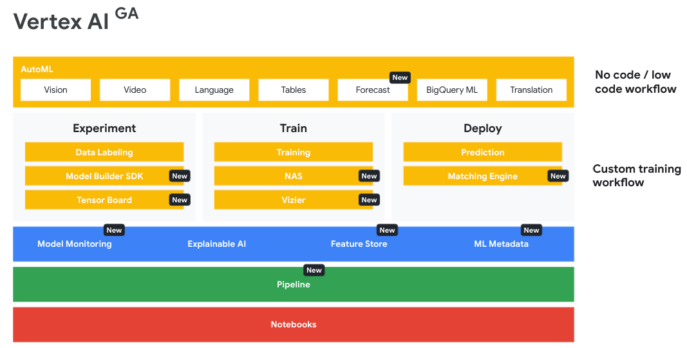

# Prepare Data for ML APIs on Google Cloud
## Vertex  AI Qwik Start

- In this lab we use:
    - BigQuery: For data processing and EDA.
    - Vertex AI: For training and deploy a custom TF Regressor model to predict customer lifetime value.

- General Architecture of VertexAI

- Theoretical Concepts: 
    * Vertex AI Workbench
    * Vertex AI Instances
    * Big Query

## Dataprep: Qwik Start

In this lab, you learn how to use Dataprep to complete the following tasks:

- Import data
- Correct mismatched data
- Transform data
- Join data

Dataprep is used to add a dataset and create recipes to wrangle the data into meaningful results.

- Theoretical Concepts:
    * Dataprep
    * Data import from Cloud Storage into bigQuery
    * Recipes

## Dataflow: Qwik Start - Templates

In this lab, you learn how to create a streaming pipeline using one of Google's Dataflow templates. More specifically, you use the Pub/Sub to BigQuery template, which reads messages written in JSON from a Pub/Sub topic and pushes them to a BigQuery table.
- Create a BigQuery dataset and table
- Create a Cloud Storage bucket
- Create a streaming pipeline using the Pub/Sub to BigQuery Dataflow template

- Learning outcome: Created a streaming pipeline using the Pub/Sub to BigQuery Dataflow template, which reads messages written in JSON from a Pub/Sub topic and pushes them to a BigQuery table.

- Theoretical Concepts:
    * DataFlow
    * Using Templates.
    * BigQuery Dataset
    * Pub/Sub to BigQuery