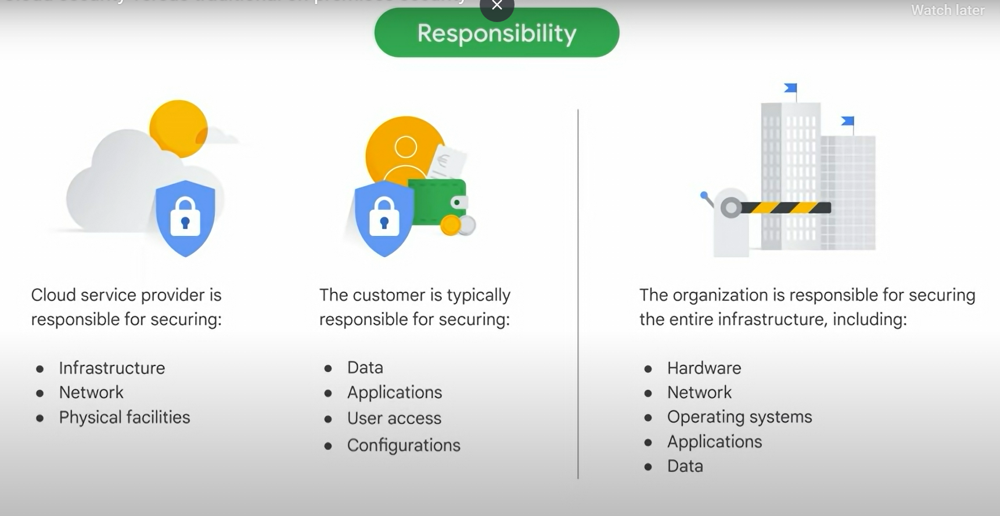

# 05 Trust and Security with Google Cloud
#### Introduction
* The objective of this course, trust and security with Google Cloud, is to equip you with the knowledge and kills necessary to discuss fundamental cloud security concepts, explain the business value of Google's multi layered approach to infrastructure security.
* And describe how Google Cloud earns and maintains customer trust in the cloud.
#### Trust and Security in the Cloud.
##### Introduction
* Securing data, applications, and infrastructure in the cloud is a complex and ever evolving challenge.
* As new threats and vulnerabilities emerge, organizations must stay ahead of the curve and adapt their security strategies to mitigate risks effectively.
* Important Terminology:
    * Terms related to access control
        * Privileged access: Grants specific set of users access to a broader set of resources than ordinary users. It is essential to manage and monitor such access carefully
        * Least privilege:  Advocates granting users only the access they need to perform their job responsibilities
        * Zero-trust architecture: Assumes that no user or device can be trusted by default.
    * Terms related to cyber threats
        * Security by default: Security by default is a principle that emphasizes integrating security measures into systems and applications from the initial stages of development.
        * Security posture: refers to the overall security status of a Cloud environment. It indicates how well an organization is prepared to defend against cyber attacks by evaluating their security controls, policies, and practices.
        * Cyber resilience: refers to an organization's ability to withstand and recover quickly from cyber attacks.
    * Terms related to security measures:
        * Firewall: A network device that regulates traffic based on predefined security rules.
        * Encryption: The process of converting data into an unreadable format by using an encryption algorithm.
        * Decryption: The process of restoring encrypted data back to it's original form using an encryption key.
* Cloud Security Components: 
    * Essential aspects of security Confidentiality-Integrity-Availability (CIA)
        * Confidentiality is about keeping important information safe and secret.
        * Integrity means keeping data accurate and trustworthy.
        * Availability is all about making sure that Cloud systems and the services are always accessible and ready for use by the right people when needed.
        * By integrating these principles into a comprehensive Cloud security model, organizations can establish a strong foundation for protecting their data, maintaining data integrity, and ensuring continuous access to critical resources.
* Cloud Security v/s On Premises Security:
    * LOCATION: Security measures are taken care of by the cloud provider, while on premises model requires the owner to handle security.
    * RESPONSIBILITY: 
    
    * SCALABILITY: Cloud offers scalable and elastic resources.On premises security requires organizations to provision and maintain their own infrastructure, which can be more time consuming and costly when they scale up or down.
    MAINTENANCE: Cloud service providers handle infrastructure maintenance, including security updates, patching, and software upgrades.
    CAPITAL EXPENDITURE: Cloud security follows an operational expenditure OpEx model, where organizations pay for the services they consume on a subscription basis. Traditional on premises security models involve significant capital expenditure CapEx, because organizations must purchase and maintain their own security infrastructure.

* Cybersecurity Threats: 
    * Deceptive social engineering: phishing attacks, which collect personal details about you, your employees, or your students.
    * Physical damage, whether it be damage to hardware components, power disruptions, or natural disasters such as floods, fires, and earthquakes, organizations are responsible for safeguarding data even in the face of physical adversity.
    * Malwares, Viruses & Ransomware
    * Vulnerable 3rd Party Systems
    * Configuration Mishaps: misconfiguration occurs when errors arise during the setup or configuration of resources, which inadvertently exposes sensitive data and systems to unauthorized access.
    NOTE: Surveys consistently identify misconfiguration as the most prominent threat to cloud security.

#### Google's Trusted Infrastructure
##### Data Centers
* At present, Google operates over 30 state of the art data centers worldwide, with some still under construction.
* One of the greatest advantages of Google's data centers is the implementation of a zero-trust architecture, which ensures enhanced security at every level.
* We measure our success through the power usage effectiveness, or PUE score. The data center in Hamina, Finland, stands out as one of the most advanced and efficient facilities in our fleet.

##### Secure Storage
* Cloud KMS: Cloud key management service allows you to manage your encryption keys yourself.
* Memory encryption: locks your data inside the computer's memory, making it nearly impossible for unauthorized users to gain access to it.
* AES: Advanced Encryption Algorithm.
* Whether your data is resting, traveling, or actively in use, encryption acts as your loyal guardian because it ensures its confidentiality and protection.

##### Identity
* Authentication: It serves as a gatekeeper because it verifies the identity of users or systems that seek access.
* Authorization: Determines what the authenticated user is allowed to do within the system.
* Auditing: Monitoring and tracking user activities within a system.
* Identity and Access Manager (IAM) : provides granular control over who has access to Google Cloud resources and what they can do with those resources, organizations can use identity and access management, or IAM.

With IAM, you can create and manage user accounts, assign roles to users, grant and revoke permissions to resources, audit user activity, and monitor your security position.

##### Network Security
* Zero Trust Networks : It means that every access request is thoroughly verified and both the user's identity and context are considered.
* Services that allow you to establish secure connections between google cloud resources and OnPremises/Other cloud networks.
    * Cloud VPN: 
    * Cloud Interconnect
* Virtual Private Cloud (VPC)

##### Security Operations (SecOps)
* SecOps, short for security operations, is all about protecting your organization's data and systems in the Cloud. It involves a combination of processes and technologies that help reduce the risk of data breaches, system outages, and other security incidents.

* Activities in SecOps:
    * Vulnerability Management:  is the process of identifying and fixing security vulnerabilities in Cloud infrastructure and applications.
    
        *  Google Cloud's security command center (SCC):  provides a centralized view of your security posture. It helps to identify and fix vulnerabilities, and it ensures that your infrastructure remains solid and protected.

    * Log Management: Google Cloud offers a Cloud logging a service to collect and analyze security logs from your entire Google Cloud environment.
    * Incident Response: 
    * Education
* Benefits of SecOps:
    * Reduced risk of data breaches
    * Increased Uptime
    * Improved uptime.
    * enhanced employee productivity

#### Google Clouds Trust Principle and Compliance
* Topics:
    * Google seven Trust principles
    * Data residency 
    * Data sovereignty options
##### GC Trust Principles and Transparency Reports
1. You iwn your data, not Google.
2. Google does not sell customer data to 3rd parties.
3. Google Cloud does not use customer data for advertising.
4. All customer data is encrypted by default.
5. We guard against insider access to your data.
6. We never give any government entity backdoor access.
7. Our privacy practices are audited against international standards.

##### Data Residency and Data Sovereignty
* Data sovereignty refers to the legal concept that data is subject to the laws and regulations of the country where it resides.
* Data residency refers to the physical location where data is stored or processed.
* Google Cloud Armor lets you restrict traffic locations for your external load balancer by adding an extra layer of protection.

##### Industry and Regional Compliance
* Google Cloud Compliance Resource center: This comprehensive hub provides detailed information on the certifications and compliance standards we satisfy. You can find mappings of our security, privacy and compliance controls to global standards.